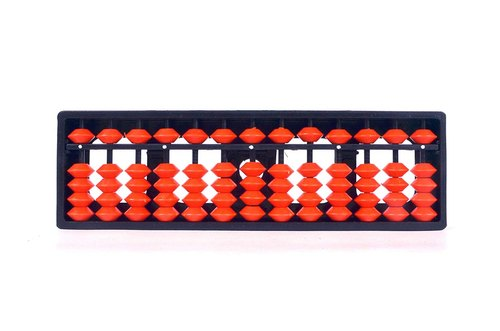

```{r child = "setup.Rmd"}
```

```{r packages, echo=FALSE, message=FALSE, warning=FALSE}
library(tidyverse)
 library(gapminder)
library(knitr)
knitr::opts_chunk$set(fig.height = 2, fig.width = 3, dpi = 300) 
```


```{css, echo=FALSE}
/* custom.css */
.left-code {
  color: #777;
  width: 38%;
  height: 92%;
  float: left;
}
.right-plot {
  width: 60%;
  float: right;
  padding-left: 1%;
}
.plot-callout {
  height: 225px;
  width: 450px;
  bottom: 5%;
  right: 5%;
  position: absolute;
  padding: 0px;
  z-index: 100;
}
.plot-callout img {
  width: 100%;
  border: 4px solid #23373B;
}
```


## Practice Exercise 1:
```{r, echo = F}
pet_df <- tibble(family = c("Ung", "Ung", "Ung", "Oliver", "Oliver"),
                 pet_type = c("cat", "dog", "cat", "dog", "dog"),
                 age = c(10, 4, 2, 8, 12))
```

```{r}
pet_df
```

Sketch the resulting data frame:
```{r, eval = F}
pet_df %>%
  group_by(pet_type) %>%
  summarize(num = n(),
            mean = mean(age))

```

---
## Practice Exercise 2:
```{r, echo = F}
pet_df <- tibble(family = c("Ung", "Ung", "Ung", "Oliver", "Oliver"),
                 pet_type = c("cat", "dog", "cat", "dog", "dog"),
                 age = c(10, 4, 2, 8, 12))
```

```{r}
pet_df
```

Sketch the resulting data frame:

```{r, eval = F}
pet_df %>%
  group_by(pet_type, family) %>%
  summarize(num = n(),
            mean = mean(age))
```
---

## Practice Exercise 3:
```{r, echo = F}
country_df <- tibble(country = c("Anglia", "Xeno", "Spatarium", "Pluti", "Cincroane", "Franktum"),
                    continent = c("X", "X", "X", "Y", "Z", "Z"),
                    population = c(50, 40, 20, 10, 70,  40),
                    square_miles = c(10, 100, 30, 40, 20, 60))
```

```{r}
country_df
```
Sketch the resulting data frame:
```{r, eval = F}
country_df %>%
  group_by(continent) %>%
  summarize(sum_population = sum(population),
            sum_square_miles = sum(square_miles))
```
---

## Practice Exercise 4:
```{r, echo = F}
country_df <- tibble(country = c("Anglia", "Xeno", "Spatarium", "Pluti", "Cincroane", "Franktum"),
                    continent = c("X", "X", "X", "Y", "Z", "Z"),
                    population = c(50, 40, 20, 10, 70,  40),
                    square_miles = c(10, 100, 30, 40, 20, 60))
```

```{r}
country_df
```

Sketch the resulting data frame:

```{r, eval = F}
country_df %>%
  group_by(country) %>%
  summarize(num = n())
```
---
## Exercise 1 

```{r}
pet_df

pet_df %>%
  group_by(pet_type) %>%
  summarize(num = n(),
            mean = mean(age))

```

---

## Exercise 2 

```{r}
pet_df

pet_df %>%
  group_by(pet_type, family) %>%
  summarize(num = n(),
            mean = mean(age))

```
---

## Exercise 3

```{r}
country_df

country_df %>%
  group_by(continent) %>%
  summarize(sum_population = sum(population),
            sum_square_miles = sum(square_miles))
```

---

## Exercise 4
```{r}
country_df

country_df %>%
  group_by(country) %>%
  summarize(num = n())

```


---

## abacus dataset

* Does training kids to use an abacus help with their math skills?

```{r, echo = F, out.width= 800}

```


---
##  Let's read in the dataset

```{r}
abacus_data <- read_csv("data/tidy_majic_data.csv")
```

---

##  Here's what it looks like

```{r}
abacus_data %>%
  head() %>%
  kable(format = "html")
```

---
## A new tidyverse function: `slice()`

* `slice()` is like `filter()` in that it subsets your dataframe by rows. 
--

* Filter subsets rows through Booleans
--

* Slice subsets rows through indices

--
* For example, the following code selects the 2nd and 3rd row from the data frame.

--
```{r}
abacus_data %>%
  slice(c(2,3)) %>% #<<
  kable(format = "html")
```

---

* We can also specify a range of indices. The following code uses the ":" symbol to subset to rows 2, 3, and 4. 
--

```{r}
abacus_data %>%
 slice(2:4) %>% #<<
 kable(format = "html")
```

--

* How would you produce the same output as `head()` (default)?

---

```{r}
abacus_data %>%
 slice(1:6) %>% #<<
 kable(format = "html")
```

---
## A new tidyverse function: `distinct()`

* `distinct()` returns a subset of rows in your data frame (similiar to  `filter()`)
--

* Specifically, `distinct` returns ONE row in your data frame for each value of a variable you pass it.
--

* The `abacus_data` data frame contains 2,094 rows - one row for each subject-task-time combination. 

---
* For example, the following code returns a data fram with ONE row for each subject id. 

--

```{r}
abacus_data %>%
 distinct(subid)
```

---

* The following code returns a data frame with ONE row for each subject id and time. 

--

```{r}
abacus_data %>%
 distinct(subid, time)
```

---

* You can keep the other variables in the data frame by adding the argument `.keep_all = T` to `distinct()`. 

--

```{r}
abacus_data %>%
 distinct(subid, time, .keep_all = T) #<<
```


---

## Let's get started with exploring these data. 

* Let's look at the scores in this datasets.
--

* What kind of variable is scores?
--

* What kind of geoms could we use to look at scores?
--

* Let's try visualizing the scores with a histogram
--

* The geom for histograms is `geom_histogram()`
---

 How do we start? What aesthetics does `geom_histogram()` take?

```{r, echo = F}
abacus_data %>%
 slice(1:6) %>% 
 kable(format = "html")
```


---

# A basic ggplot
```{r mappin, eval = F}
ggplot(data = abacus_data, aes(x = score)) + 
  geom_histogram() 
```

```{r, eval = F}
ggplot(abacus_data, aes(x = score)) + 
  geom_histogram() 
```


--

.right-plot[
```{r mappin, ref.label="mappin", echo=FALSE, fig.dim=c(8, 6), out.width="100%", message = F, warning = F}
```
]


Note that you don't have to name the arguments, though it's usually a good idea to.

--

This is great, except we can't see the different tasks.

--

What can we do about this?
---

We could try coloring the different task differently.
--
```{r colorgramp, eval = F}
ggplot(abacus_data, aes(x = score, color = task)) + 
  geom_histogram() 
```
--


.right-plot[
```{r colorgramp, ref.label="colorgramp", echo=FALSE, fig.dim=c(8, 6), out.width="100%", message = F, warning = F}
```
]

That's not quite want we wanted. We wanted the **fill** aesthetic. 

--

The **color** aesthetic determines the hue of the border; the **fill** aesthetic determines the hue of the inside of the bar. 


---

```{r fillgramp, eval = F}
ggplot(abacus_data, aes(x = score, fill = task)) + 
  geom_histogram() 
```
--

.right-plot[
```{r  ref.label="fillgramp", echo=FALSE, fig.dim=c(8, 6), out.width="100%", message = F, warning = F}
```
]

This is looking better. But it's still a lot of information.

---
## A new channel: `alpha`

Alpha controls how "transparent" the geom is. 

--

It ranges from zero to one. One is most transparent.
--


```{r alpha, eval = F}
ggplot(abacus_data, aes(x = score, fill = task)) + 
  geom_histogram(alpha = .2) #<<
```

.right-plot[
```{r  ref.label="alpha", echo=FALSE, fig.dim=c(8, 6), out.width="100%", message = F, warning = F}
```
]
--

This is still a lot of information.
--

What could we do?

---

## Facet!

 Let's use `facet_wrap()` to facet by task.
--

```{r facet, eval = F}
ggplot(abacus_data, aes(x = score, fill = task)) + 
  geom_histogram(alpha = .2) +
  facet_wrap(~task) #<<

```

--

.right-plot[
```{r  ref.label="facet", echo=FALSE, fig.dim=c(8, 6), out.width="100%", message = F, warning = F}
```
]
---


The fill and alpha aesthetics aren't really doing anything for us here. Let's get rid of them
--

```{r facet2, eval = F}
ggplot(abacus_data, aes(x = score)) + 
  geom_histogram() +
  facet_wrap(~task)

```

--

.right-plot[
```{r  ref.label="facet2", echo=FALSE, fig.dim=c(8, 6), out.width="100%", message = F, warning = F}
```
]
---

What if we wanted to facet by grade rather than score?

--

```{r facet3, eval = F}
ggplot(abacus_data, aes(x = score)) + 
  geom_histogram() +
  facet_wrap(~grade) #<<

```

--

.right-plot[
```{r  ref.label="facet3", echo=FALSE, fig.dim=c(8, 6), out.width="100%", message = F, warning = F}
```
]
---

How would we facet by BOTH grade and score?

--

`facet_grid()`

--

How would we put the different task facets on horizontally, and the grade facets vertically?

--

The general syntax is "vertical variable" ~ "horizontal variable"

--

```{r facet4, eval = F}
ggplot(abacus_data, aes(x = score)) + 
  geom_histogram() +
  facet_grid(grade~task) #<<
```


.right-plot[
```{r  ref.label="facet4", echo=FALSE, fig.dim=c(10, 6), out.width="100%", message = F, warning = F}
```
]

---

What we're really interested in here, though, is whether or not students got better at these tasks after over time.

--


Let's use fill to show the pre and post distributions.

--
```{r time, eval = F}
ggplot(abacus_data, aes(x = score, fill = time)) + #<<
  geom_histogram() +
  facet_grid(grade~task) 
```


.right-plot[
```{r  ref.label="time", echo=FALSE, fig.dim=c(10, 6), out.width="100%", message = F, warning = F}
```
]


---

Let's do a few more things to make our plot more attractive.

```{r pretty, eval = F}
ggplot(abacus_data, aes(x = score, fill = time)) + #<<
  geom_histogram(bindwidth = .1) + #<<
  facet_grid(grade~task)  +
  scale_fill_brewer(name = "Grade", palette = "Pastel1") +  #<<
  ylab("Number of Students") +  #<<
  xlab("Score") + #<<
  scale_x_continuous(breaks = c(0, .5, 1)) +  #<<
  theme_classic(base_size = 16) #<<
```
--
.right-plot[
```{r  ref.label="pretty", echo=FALSE, fig.dim=c(10, 6), out.width="100%", message = F, warning = F}
```
]

---

```{r , echo = F, message = F, warning = F, fig.dim=c(10, 6),}
ggplot(abacus_data, aes(x = score, fill = time)) + #<<
  geom_histogram(bindwidth = .1) + #<<
  facet_grid(grade~task)  +
  scale_fill_brewer(name = "Time", palette = "Pastel1") +  #<<
  ylab("Number of Students") +  #<<
  xlab("Score") + #<<
  scale_x_continuous(breaks = c(0, .5, 1)) +  #<<
  theme_classic(base_size = 16) #<<
```

---

Do scores get better over time?

--

Let's add a vertical line to each distribution that shows the mean.

--

How do we calculate the mean of each distribution?

--

We want the mean by task, grade, and time.

--

We neet to **`group_by`** task, grade, and time, and then **`summarize`.**
--


```{r}
distribution_means <- abacus_data %>%
  group_by(task, time, grade) %>% #<<
  summarize(dist_mean = mean(score, na.rm=TRUE))  #<<
```

--

```{r, echo = F}
distribution_means
```
---

Now we have a new data frame with the means of each distribution.
-- 

How can we add them to our plot? 

--

The geom for adding vertical lines is called `geom_vline()`

--

`geom_vline()` requires an aesthetic that tells it where to intersect the x-axis called **xintercept**.

--

```{r, message = F, warning = F, eval = F}
ggplot(abacus_data, aes(x = score, fill = time)) + 
  geom_histogram(bindwidth = .1) + 
  geom_vline(data = distribution_means, aes(xintercept = dist_mean)) + #<<
  facet_grid(grade~task)  +
  scale_fill_brewer(name = "Time", palette = "Pastel1") +  
  ylab("Number of Students") +  
  xlab("Score") +
  scale_x_continuous(breaks = c(0, .5, 1)) + 
  theme_classic(base_size = 6) 
```

---

```{r, echo = F, fig.dim=c(10, 6), out.width="100%", message = F, warning = F}
ggplot(abacus_data, aes(x = score, fill = time)) + 
  geom_histogram(bindwidth = .1) + 
  geom_vline(data = distribution_means, aes(xintercept = dist_mean)) + #<<
  facet_grid(grade~task)  +
  scale_fill_brewer(name = "Time", palette = "Pastel1") +  
  ylab("Number of Students") +  
  xlab("Score") +
  scale_x_continuous(breaks = c(0, .5, 1)) + 
  theme_classic(base_size = 6) +
  theme(legend.position = "bottom")

```

---

Let's color the lines to correspond to the distribution. 

--

```{r, message = F, warning = F, eval = F}
ggplot(abacus_data, aes(x = score, fill = time)) + 
  geom_histogram(bindwidth = .1) + 
  geom_vline(data = distribution_means, aes(xintercept = dist_mean, color = time)) + #<<
  facet_grid(grade~task)  +
  scale_color_brewer(name = "Time", palette = "Pastel1", guide = F) +   #<<
  scale_fill_brewer(name = "Time", palette = "Pastel1") +  
  ylab("Number of Students") +  
  xlab("Score") +
  scale_x_continuous(breaks = c(0, .5, 1)) + 
    theme_classic(base_size = 6) +
  theme(legend.position = "bottom")
```

---
```{r, echo = F, fig.dim=c(10, 6), out.width="100%", message = F, warning = F}
ggplot(abacus_data, aes(x = score, fill = time)) + 
  geom_histogram(bindwidth = .1) + 
  geom_vline(data = distribution_means, aes(xintercept = dist_mean,  color = time)) + #<<
  facet_grid(grade~task)  +
  scale_color_brewer(name = "Time", palette = "Pastel1") +  
  scale_fill_brewer(name = "Time", palette = "Pastel1") +  
  ylab("Number of Students") +  
  xlab("Score") +
  scale_x_continuous(breaks = c(0, .5, 1)) + 
    theme_classic(base_size = 6) +
  theme(legend.position = "bottom")
```

---


Okay, but the key question is: Did kids get better more when they got the abacus training?

--

Let's look at this just for the first grade group, and only the arithmetic task and spatial working memory tasks.

--

How could subset to these rows?

--

```{r}
abacus_data
```
---


```{r}
first_grade_abacus_data <- abacus_data %>%
            filter(grade == "First Grade", #<<
                   task %in% c("Spatial WM", "Arithmetic")) #<<
```

```{r}
first_grade_abacus_data
```

---
```{r, eval = F}
ms <- first_grade_abacus_data %>%
  group_by(group, task, time) %>%
  summarize(mean_score = mean(score, na.rm = T))

ggplot(first_grade_abacus_data, aes(x = score, fill = time)) +
  geom_histogram() + 
  geom_vline(data = ms, aes(xintercept = mean_score, color = time), linetype = 2) + #<<
  facet_grid(group~task) +
  scale_color_brewer(guide = "none", palette = "Pastel1") +  

  scale_fill_brewer(name = "Time", palette = "Pastel1") +  
  ylab("Number of Students") +  
  xlab("Score") +
  scale_x_continuous(breaks = c(0, .5, 1)) + 
  theme_classic(base_size = 12) 
```

---
Does abacus training help?

```{r, echo = F, message = F, warning = F}
ms <- first_grade_abacus_data %>%
  group_by(group, task, time) %>%
  summarize(mean_score = mean(score, na.rm = T))

ggplot(first_grade_abacus_data, aes(x = score, fill = time)) +
  geom_histogram() + 
  geom_vline(data = ms, aes(xintercept = mean_score, color = time), linetype = 2) +
  facet_grid(group~task) +
  scale_color_brewer(guide = "none", palette = "Pastel1") +  
  scale_fill_brewer(name = "Time", palette = "Pastel1") +  
  ylab("Number of Students") +  
  xlab("Score") +
  scale_x_continuous(breaks = c(0, .5, 1)) + 
  theme_classic(base_size = 8) +
  theme(legend.position="bottom")
```


