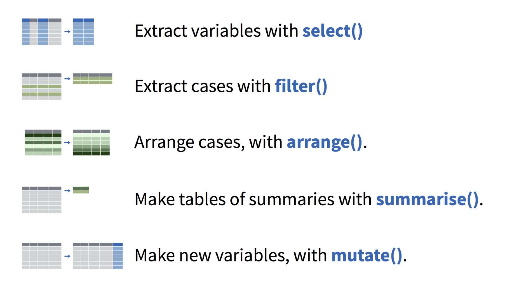
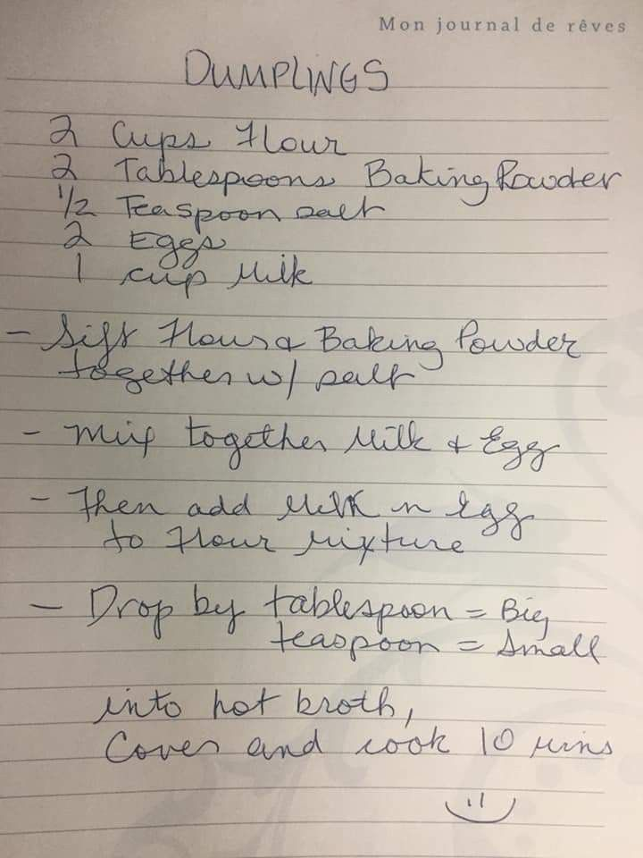
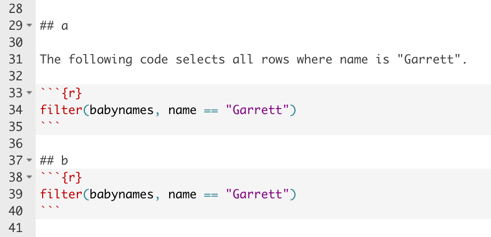
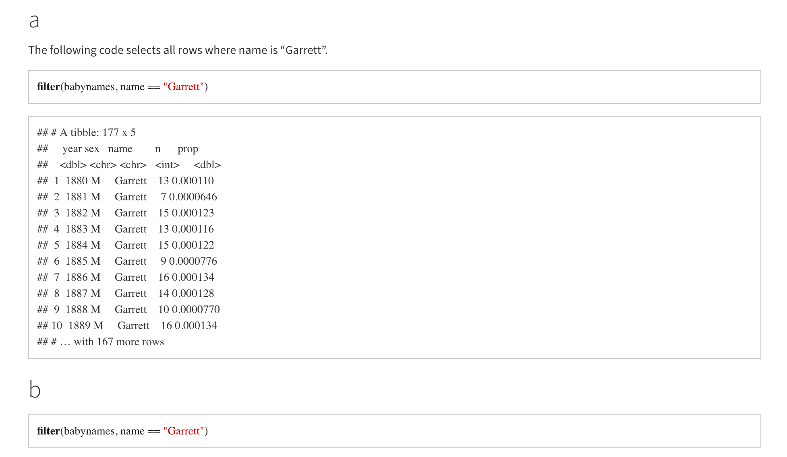

class: center, middle

```{r child = "setup.Rmd"}
```

```{r packages, echo=FALSE, message=FALSE, warning=FALSE}
library(tidyverse)
 library(gapminder)
library(knitr)
#knitr::opts_chunk$set(fig.height = 2, fig.width = 3, dpi = 300) 

gapminder <- janitor::clean_names(gapminder)
```


```{css, echo=FALSE}
/* custom.css */
.left-code {
  color: #777;
  width: 38%;
  height: 92%;
  float: left;
}
.right-plot {
  width: 60%;
  float: right;
  padding-left: 1%;
}
.plot-callout {
  height: 225px;
  width: 450px;
  bottom: 5%;
  right: 5%;
  position: absolute;
  padding: 0px;
  z-index: 100;
}
.plot-callout img {
  width: 100%;
  border: 4px solid #23373B;
}
```


## A couple new functions

---
##  `count()`

`count()` is a useful shortcut for `group_by() %>% summarize(num = n())`.

--
This code:
```{r, eval = F}
gapminder %>%
  group_by(country) %>%
  summarize(num_countries = n())
```

--

Does the same as this:

--

```{r, eval = F}
gapminder %>%
  count(country) 
```

---
##  `glimpse()`

Glimpse is useful for getting the "big picture" view of your data frame.

--

```{r}
glimpse(gapminder)
```

--

`summary()` does something similiar:
--
```{r}
summary(gapminder)
```

---
## And some old functions

```{r, eval = T, echo = F, out.width = 700}

```

---

class: center, middle
## Some points of confusion

```{r, echo = F}
gapminder <- gapminder %>%
  janitor::clean_names()

```


---


## `%in%` vs. `%>%`

Even though these symbols are made up of three characters, you should think of them as a single symbol. 

--

Despite their apparent similarity, these functions aren't really related to each other.

--

`%in%` checks whether something is a member of a set.

--

```{r}
4 %in% c(1,2,3,4)
```


```{r}
5 %in% c(1,2,3,4)
```


--

`%>%` ("the pipe") sends the output of one function to another function.


--


```{r, eval = F}
gapminder %>%
  group_by(country) %>%
  summarize(num_countries = n())
```


---
## The scope of `aes()`

Remember this plot?


--

```{r oldplot, eval = F}
ggplot(data = gapminder, mapping = aes(x = gdp_percap, 
                                       y = life_exp)) +
  geom_point() +
  geom_smooth(method = "lm") +
  scale_x_log10() +
  ylab("Life Expectancy (Years)") +
  xlab("GDP Per Capita") +
  theme_classic(base_size = 16)
```

.right-plot[
```{r, ref.label="oldplot", echo=FALSE, fig.dim=c(8, 6), out.width="100%"}
```
]


---

Another way to write this is by putting the aesthetics in the geom functions themselves 

--

```{r country3, eval = F}
ggplot(data = gapminder) +
  geom_point(mapping = aes(x = gdp_percap,y = life_exp)) +
  geom_smooth(mapping = aes(x = gdp_percap,  y = life_exp), method = "lm") +
  scale_x_log10() +
  ylab("Life Expectancy (Years)") +
  xlab("GDP Per Capita") +
  theme_classic(base_size = 16)
```

.right-plot[
```{r, ref.label="country3", echo=FALSE, fig.dim=c(8, 6), out.width="100%"}
```
]

--

But notice because `geom_point()` and `geom_smooth()` require both `x` and `y` aesthetics we have to include the mappings in both.

--

Mappings put in the `ggplot()` function apply to all geoms. 


---

## A common error: Forgetting a pipe

--
```{r, eval = F}
gapminder %>%
  group_by(country) 
  summarize(num_countries = n()) %>%
  mutate(num_countries_round = round(num_countries))
```

--

`Error: n() should only be called in a data context
Call `rlang::last_error()` to see a backtrace.`

--

Error will depend on what exactly you're trying to do. But check this furst if you get an error you don't understand!

---

## A common error: Forgetting the `+`


```{r errorplot, eval = F}
ggplot(data = gapminder, mapping = aes(x = gdp_percap, 
                                       y = life_exp)) +
  geom_point() +
  geom_smooth(method = "lm") 
  scale_x_log10() +
  ylab("Life Expectancy (Years)") +
  xlab("GDP Per Capita") +
  theme_classic(base_size = 16)
```

--

`Error: Cannot add ggproto objects together. Did you forget to add this object to a ggplot object?`

---

## A common error: Forgetting to load packages


```{r  eval = F}
cool_data_frame <- read_csv("data/cool_data_frame.csv")
```


--

`Error: object 'read_csv' not found`

--

Solves the problem:
```{r  eval = F}
library(tidyverse)
cool_data_frame <- read_csv("data/cool_data_frame.csv")
```

--

You have to load packages before you can use their functions!


---

class: center, middle

## Notes on style
---

## Style

--

* Why does style matter? 
--

* Style doesn't matter to the computer, but it does matter to **humans** who produce, intepret and modify code.
--

* Having a code specific, consistent code style makes your own code easier to understand and debug, and it helps others do the same.
--

* In this class, **variable names** in data frames should be all lower case and descriptive. Separate multiple words with an underscore (`_`).
--

* BAD: `NEWVARIABLE `, `thing `, `LIFEexpectancy `, `Time`
--

* GOOD: `num_countries    `, `age_years `, `life_expectancy `, `log_reaction_time_seconds`
--

* In this class, if you can use the pipe, **always use the pipe** (unless there's only a single function)
---

# Line breaks

In the tidyverse, you should think of each **line** as doing **one** thing.

Like instructions in a  recipe:

```{r, eval = T, echo = F, out.width= 350}

```

---

 Data frame goes on own line, then each function (verb) on its own line after that (indent after first).
--


**GREAT**:

```{r, eval = F}
gapminder %>%
  group_by(country) %>%
  summarize(num_countries = n()) %>%
  mutate(num_countries_round = round(num_countries))
```

--

**BAD**:

```{r, eval = F}
gapminder %>% group_by(country)  %>% summarize(num_countries = n()) %>% 
  mutate(num_countries_round = round(num_countries))
```

---

Same for ggplot. Imagine your plot is a house and you're building it brick by brick. 
--


```{r, eval = T, echo = F, out.width= 600}

```


Each "brick" of the plot goes on its own line. 
---

Each layer of your plot goes on its own line.

**GREAT**:

```{r, eval = F}
ggplot(data = gapminder, mapping = aes(x = gdp_percap, 
                                       y = life_exp)) +
  geom_point() +
  geom_smooth(method = "lm") +
  scale_x_log10() +
  ylab("Life Expectancy (Years)") +
  xlab("GDP Per Capita") +
  theme_classic(base_size = 16)
```

--

**BAD**:

```{r, eval = F}
ggplot(data = gapminder, mapping = aes(x = gdp_percap, 
                                       y = life_exp)) + geom_point() +
  geom_smooth(method = "lm") + scale_x_log10() + ylab("Life Expectancy (Years)") + 
  xlab("GDP Per Capita") +theme_classic(base_size = 16)
```


---


## Style for knitting
--

* No need to use `print()` function in .Rmd - will print output automatically.

--
* Make sure you look at your .html after you knit. Does it look as you expected? If not, go back to .Rmd.
--

* You can change size of plot output in .Rmd by specificy `fig.width` and `fig.height` in the relevant R chunk. In general, aim for the "plot" plot of your plot (i.e. excluding the legend) to be roughly square (or slightly wider than square).

`{r CHUNKNAME, fig.width = 4.5, fig.height = 4}`
---
##  "Literate Programming" 

Plain text mixed with code.

```{r, eval = T, echo = F}


```


--

